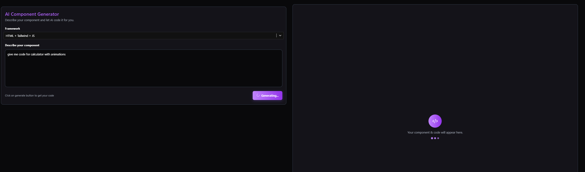
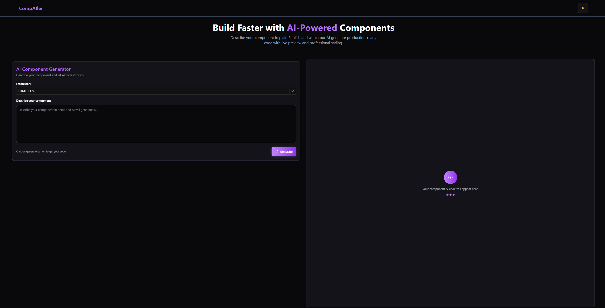
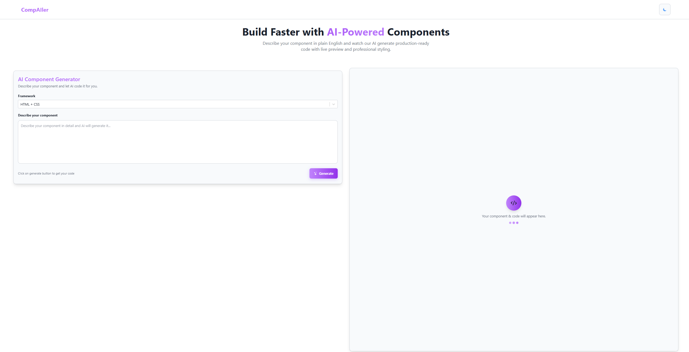
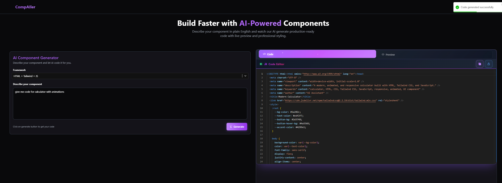
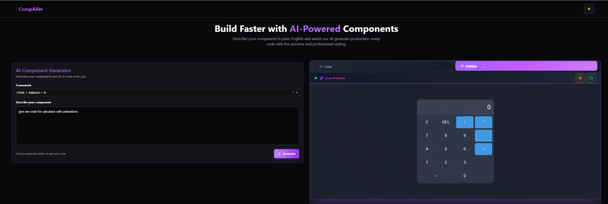
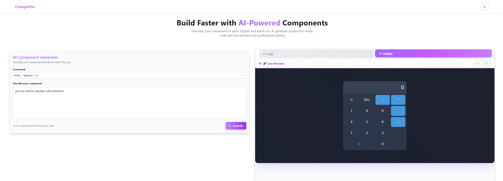
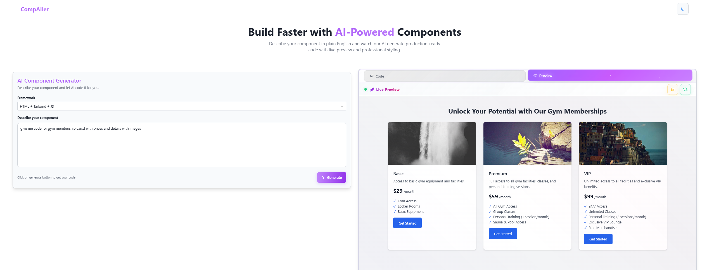

# CompAIler - AI-Powered Code Component Generator

> **⚠️ Project Status: Currently in Development**  
> This project is actively under development. Some features may be incomplete or subject to change. We're working hard to bring you the best AI-powered component generation experience!

CompAIler is a web application that helps developers generate React components using Google's Gemini AI. Think of it as having a senior developer look over your shoulder, but it's an AI that never gets tired and works 24/7.

## What Does This App Do?

CompAIler is like having a personal coding mentor. You describe what component you want, select the framework, and it:

- **Generates components** - Creates complete React/Vue/Angular components from your descriptions
- **Live preview** - Shows you how your component looks in real-time
- **Code editor** - Built-in Monaco editor (same one used in VS Code) with syntax highlighting
- **Multiple frameworks** - Supports React, Vue, Angular, and more
- **Works in dark/light mode** - Because we all have our preferences
- **Export functionality** - Download or copy your generated code

## Screenshots of UI

### Component Generation in Progress
AI processing your component request with loading animation



### Dark Mode Interface
Professional dark theme with enhanced code editor



### Light Mode Interface  
Clean light theme for daytime development



### Generated Component - Example 1
Complete component with live preview and code editor



### Generated Component - Example 2
Advanced component generation with styling



### Generated Component - Example 3
Complex component with interactive elements



### Generated Component - Example 4
Professional component output with responsive design



## How It Works (The Simple Version)

1. **Describe your component** - In the left panel, write what you want to build
2. **Pick your framework** - From the dropdown (React, Vue, Angular, etc.)
3. **Click Generate** - AI creates your component code
4. **See it live** - Right panel shows live preview and code editor
5. **Export your code** - Copy to clipboard or download as file

## Project Structure (What's What)

```
CompAIler/
├── src/
│   ├── App.jsx                     # Main app - orchestrates all components
│   ├── components/
│   │   ├── Navbar.jsx             # Top navigation with theme toggle
│   │   ├── ComponentGenerator.jsx  # Input form for component description
│   │   ├── CodeEditor.jsx         # Monaco code editor with live preview
│   │   └── OutputDisplay.jsx      # Component output and preview area
│   ├── hooks/
│   │   └── useComponentGenerator.js # Custom hooks for API calls
│   ├── constants/
│   │   └── prompts.js             # Framework options and AI prompts
│   ├── services/
│   │   └── geminiService.js       # Talks to Google's AI
│   ├── contexts/
│   │   └── ThemeContext.jsx       # Dark/light theme management
│   ├── utils/
│   │   └── imageUtils.js          # Image handling utilities
│   └── pages/
│       ├── Home.jsx               # Main application page
│       └── NoPage.jsx             # 404 page
├── package.json                   # Lists all the tools we need
├── .env                          # Your secret API key (don't share this!)
├── .env-dummy                    # Example of what .env should look like
└── README.md                     # This file you're reading
```

## Architecture & Component Design

The app follows modern React patterns with clean component separation:

### Modular Components
- **App.jsx** - Main coordinator, handles routing and theme provider
- **ComponentGenerator** - Input form with framework selection and description textarea
- **CodeEditor** - Monaco editor wrapper with tabs for code/preview
- **OutputDisplay** - Manages code display and live preview functionality
- **Navbar** - Navigation with theme toggle functionality

### Custom Hooks
- **useComponentGenerator** - Manages component generation API calls and state
- **useTheme** - Handles dark/light theme switching and persistence
- Separates business logic from UI components

### Clean File Organization
- `/components` - Reusable UI components
- `/hooks` - Custom React hooks for state management
- `/constants` - Shared data (framework options, prompts, etc.)
- `/services` - API integration utilities
- `/contexts` - React context providers
- `/utils` - Utility functions

### Benefits of This Structure
- **Maintainable** - Each component has a single responsibility
- **Reusable** - Components can be easily used elsewhere
- **Testable** - Isolated logic makes testing easier
- **Scalable** - Easy to add new features without breaking existing code

## Tech Stack (The Nerdy Stuff)

- **React 18** - The main framework (like the engine of a car)
- **JavaScript** - Core programming language with modern ES6+ features
- **Vite** - Makes everything fast (builds and runs the app quickly)
- **Monaco Editor** - The code editor (same one in VS Code)
- **Tailwind CSS** - Makes it look pretty without writing tons of CSS
- **Google Gemini AI** - The brain that generates your components
- **React Router** - Navigation between pages
- **React Select** - Enhanced dropdown components

## Installation (Getting It Running)

### Step 1: Get the Code
```bash
git clone https://github.com/hanzla-sib/CompAIler.git
cd CompAIler
```

### Step 2: Install Dependencies
```bash
npm install
```
This downloads all the tools the app needs to work.

### Step 3: Get Your AI Key
1. Go to [Google AI Studio](https://makersuite.google.com/app/apikey)
2. Create a free account
3. Generate an API key (it's free!)
4. Copy that key (keep it secret!)

### Step 4: Set Up Your Environment
Copy the `.env-dummy` file and rename it to `.env`:
```bash
copy .env-dummy .env
```

Open the `.env` file and replace `your_gemini_api_key_here` with your actual API key:
```
VITE_GEMINI_API_KEY=your_actual_api_key_here
```

### Step 5: Start the App
```bash
npm run dev
```
Open your browser and go to http://localhost:5173

## How to Use It

### For Component Generation:
1. **Describe your component** in the left textarea
2. **Select the framework** from the dropdown (React, Vue, etc.)
3. **Click "Generate"** button
4. **View the results** in the right panel
5. **Switch between "Code" and "Preview"** tabs to see code and live preview
6. **Copy or download** your generated component

The AI will create:
- Complete component code with proper syntax
- Responsive design with Tailwind CSS
- Interactive functionality where appropriate
- Clean, readable code structure
- Best practices implementation

### For Code Management:
1. **Copy to clipboard** - Click the copy button for instant clipboard access
2. **Download as file** - Export your component as an HTML file
3. **Refresh preview** - Update live preview if needed
4. **Fix broken images** - Automatically repair image references
5. **Open in new tab** - View your component in full browser window

## Features You'll Love

### Dark/Light Theme
Click the sun/moon icon in the top-right to switch themes with smooth animations.

### Multiple Frameworks
Supports React, Vue, Angular, HTML/CSS, and more frameworks.

### Real-time Preview
See your component come to life instantly with live preview.

### Advanced Code Editor
- Syntax highlighting
- Auto-completion
- Code folding
- Multiple themes
- Responsive design

### Responsive Design
Works perfectly on desktop, tablet, and mobile devices.

### Export Options
- Copy to clipboard with animated feedback
- Download as HTML file
- Open in new browser tab

## Common Issues and Solutions

### "API key is missing" error
- Make sure your `.env` file exists
- Check that your API key starts with `VITE_GEMINI_API_KEY=`
- Restart the development server after adding the key

### Code editor not loading
- Clear your browser cache
- Make sure you're using a modern browser (Chrome, Firefox, Safari, Edge)
- Check browser console for JavaScript errors

### AI responses are slow
- This is normal - AI takes time to think
- Free Gemini API has rate limits
- Complex component descriptions take longer to process

### Theme not switching
- Check if ThemeContext is properly wrapped around App
- Clear localStorage and refresh if theme state gets corrupted

## Building for Production

When you're ready to deploy:

```bash
npm run build
```

This creates a `dist` folder with all the files ready for hosting.

## Security Note

**Important**: This app exposes your API key in the browser. For production use, you should:

- Move the AI calls to a backend server
- Never commit your `.env` file to version control
- Consider using server-side API calls instead
- Implement proper API key management

## Contributing

Feel free to:
- Report bugs
- Suggest new features
- Submit pull requests
- Improve the documentation
- Add new framework support
- Enhance UI/UX

## Component Breakdown

### ComponentGenerator Component
- Handles framework selection with 10+ options
- Custom-styled react-select with theme support
- Responsive textarea for component descriptions
- Real-time validation and loading states
- Separated constants for easy maintenance

### CodeEditor Component
- Wraps Monaco Editor with consistent theming
- Tabbed interface for code and preview
- Theme synchronization with app-wide settings
- Export functionality with animations
- Responsive design for all screen sizes

### OutputDisplay Component
- Smart rendering based on generation state
- Live preview with iframe isolation
- Consistent error handling across all states
- Responsive layout management
- Advanced toolbar with multiple actions

### Navbar Component
- Theme toggle with smooth animations
- Responsive design with mobile support
- Consistent branding and navigation
- Icon-based action buttons

### Custom Hooks (useComponentGenerator)
- **useComponentGenerator**: Manages generation API calls, loading states, and error handling
- **useTheme**: Handles theme switching, persistence, and CSS variable management
- Separates API logic from UI components
- Reusable across different components

## What Makes This Special

Unlike other component generators:
- **Free to use** (with Gemini's free tier)
- **No sign-up required** (just need an API key)
- **Works offline** (once loaded)
- **Privacy-first** (your descriptions aren't stored anywhere)
- **Beginner-friendly** (explains everything simply)
- **Well-architected** (clean, maintainable component structure)
- **Real-time preview** (see components as they're generated)
- **Multiple export options** (copy, download, new tab)

## Need Help?

1. Check this README first
2. Look at the `.env-dummy` file for setup examples
3. Make sure your API key is correct
4. Try refreshing the page
5. Check the browser console for errors (F12)
6. Verify your internet connection (for AI API calls)

## License

This project is open source and available under the [MIT License](LICENSE).
